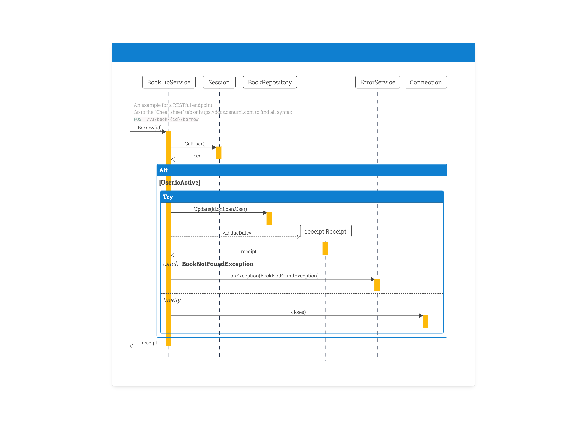

# My ZenUML Theme

[ZenUML](https://app.zenuml.com/?src=landing) is a great tool to visualise your sequence diagram, and you can define the diagram in `code`.



So essentially, it allows you to define a sequence diagram in a DSL like:

```
BookLibService.Borrow(id) {
  User = Session.GetUser()
  if(User.isActive) {
    try {
      BookRepository.Update(id, onLoan, User)
      receipt = new Receipt(id, dueDate)
    } catch (BookNotFoundException) {
      ErrorService.onException(BookNotFoundException)
    } finally {
      Connection.close()
    }
  }
  return receipt
}
```

It does the rest for you:


It also runs in many other places, like Confluence, WebStorm and so on. And the beautiful thing about it is you can customise the style by CSS.

## How to use

In the [online editor](https://app.zenuml.com/?src=landing), you can define custom CSS in the CSS tab:


I've already done some customisation, and there is some global CSS variable defined, and you can override them just as you like.

```css
:root {
  --highlight-color: #0f7fd0;
  --text-color: #444;
  --border-color: #0f7fd0;
  --occurrence-color: #fdb90a;
  --border-radius: 5px;
}
```

Have fun!